# HDTech - Ứng Dụng Thương Mại Điện Tử Chuyên Về Laptop

# HDTech - E-commerce App Specializing in Laptops

**HDTech** là ứng dụng thương mại điện tử chuyên cung cấp các sản phẩm liên quan đến **laptop**. Với sứ mệnh mang đến trải nghiệm mua sắm thuận tiện, đáng tin cậy và chuyên nghiệp, HDTech giúp người dùng dễ dàng tìm kiếm, lựa chọn và sở hữu những sản phẩm laptop chất lượng cao với mức giá hợp lý.  
**HDTech** is an e-commerce application specializing in **laptop** products. With a mission to provide a convenient, reliable, and professional shopping experience, HDTech allows users to easily search, choose, and own high-quality laptops at reasonable prices.

---

## 🚀 Tính Năng Chính | Key Features

1. **Danh Mục Sản Phẩm Đa Dạng**

   - Laptop từ các thương hiệu uy tín như Dell, HP, Apple, ASUS, Lenovo...
   - Phần cứng nâng cấp: RAM, SSD, pin, bộ sạc.  
     **Wide Product Categories**
   - Laptops from trusted brands like Dell, HP, Apple, ASUS, Lenovo...
   - Upgrade components: RAM, SSD, batteries, chargers.

2. **Tìm Kiếm Thông Minh | Smart Search**

   - Hỗ trợ tìm kiếm theo thương hiệu, giá cả, cấu hình và nhu cầu sử dụng.
   - Search by brand, price, specs, and user requirements.

3. **Đánh Giá & Nhận Xét | Reviews & Ratings**

   - Xem đánh giá từ khách hàng thực tế.
   - Chia sẻ kinh nghiệm sử dụng sản phẩm.
   - View real customer reviews.
   - Share product usage experiences.

4. **Thanh Toán Đơn Giản | Easy Payment**

   - Tích hợp hình thức thanh toán: ví điện tử.
   - Multiple payment options: e-wallets.

5. **Dịch Vụ Hậu Mãi | After-Sales Services**
   - Bảo hành chính hãng, đổi trả nhanh chóng.
   - Hỗ trợ kỹ thuật 24/7.
   - Official warranty, quick returns.
   - 24/7 technical support.

---

## 📱 Hỗ Trợ Đa Nền Tảng | Multi-Platform Support

- **Ứng dụng di động**: iOS, Android.
- **Website chính thức**: [hdtech.vn](#) _(đường link minh họa)_
- **Mobile app**: iOS, Android.
- **Official website**: [hdtech.vn](#) _(placeholder link)_

---

## 🎯 Tại Sao Chọn HDTech? | Why Choose HDTech?

- Sản phẩm **chính hãng**, giá cả cạnh tranh.
- Đội ngũ tư vấn chuyên nghiệp, tận tâm.
- Hỗ trợ khách hàng mọi lúc, mọi nơi.
- **Genuine products** with competitive prices.
- Professional and dedicated consulting team.
- Customer support anytime, anywhere.

---

## 🛠 Công Nghệ Sử Dụng | Technology Stack

- **Frontend**: Flutter, Dart.
- **Backend**: Node.js, Express.
- **Database**: MongoDB.

---

## 📧 Liên Hệ | Contact

- **Email**: support@hdtech.vn
- **Hotline**: 1900-1234
- **Địa chỉ | Address**: 123 Đường Công Nghệ, Quận 1, TP.HCM

---

## 📸 Ảnh Giao Diện Ứng Dụng | App Screenshots

|          Khởi động          |   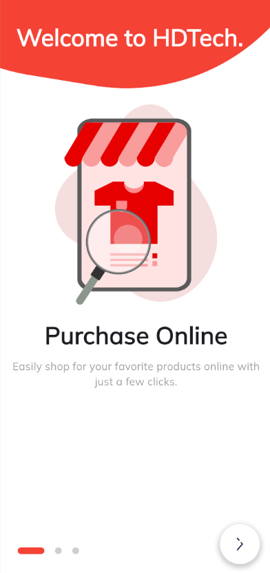 Welcome 1   |          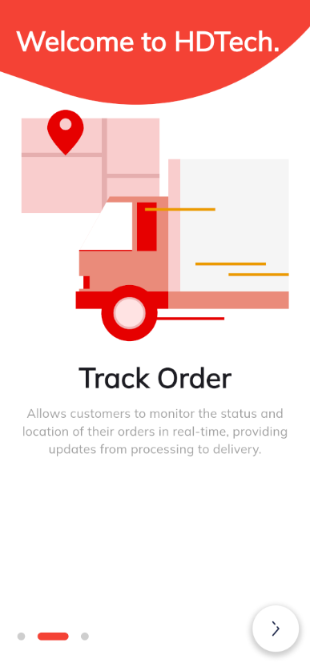 Welcome 2           |       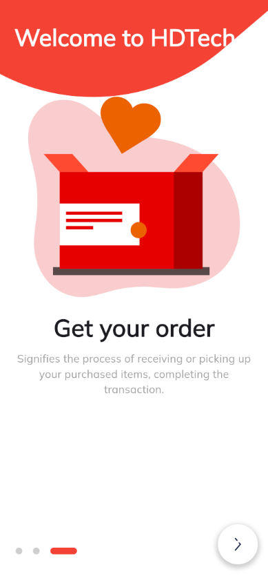 Welcome 3        |
| :-----------------------------------------------------------------: | :---------------------------------------------------: | :------------------------------------------------------------------: | :------------------------------------------------------------: |
|         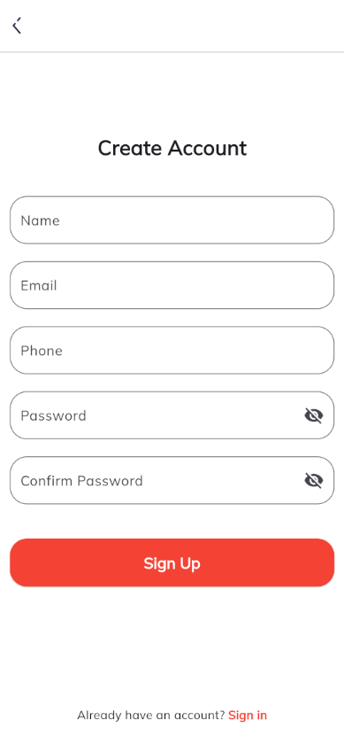 Đăng ký         | 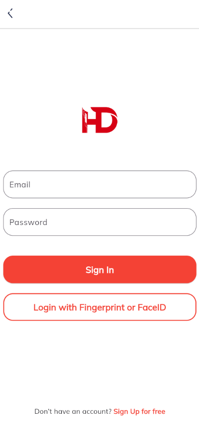 Đăng nhập |         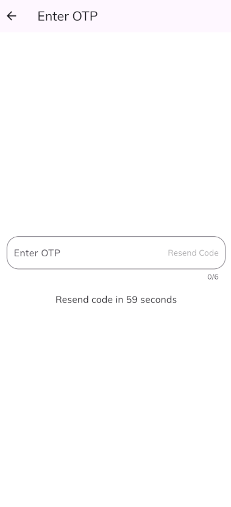 Xác thực OTP         |     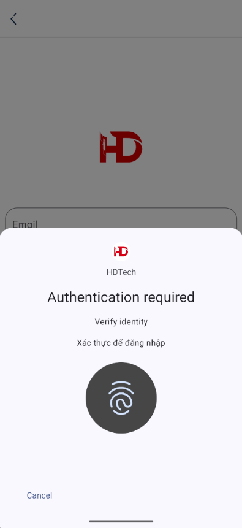 Vân tay      |
|         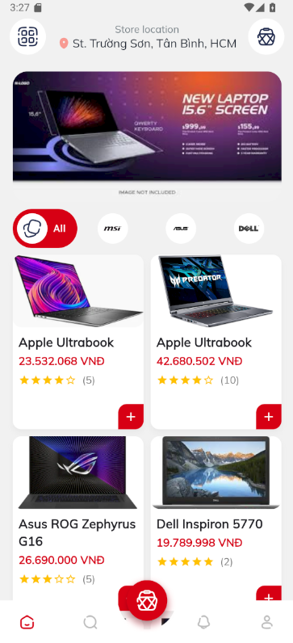 Trang chủ          |  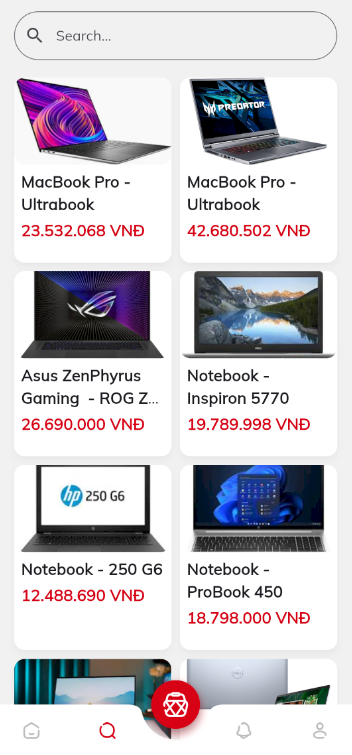 Tìm kiếm  |         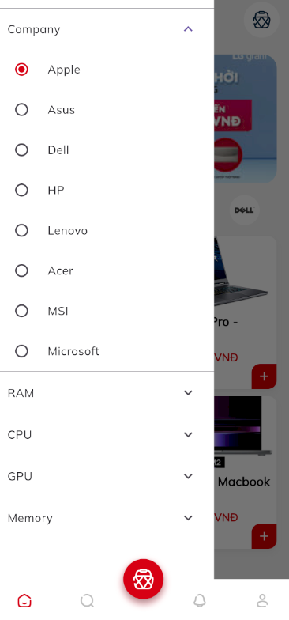 Lọc sản phẩm         |       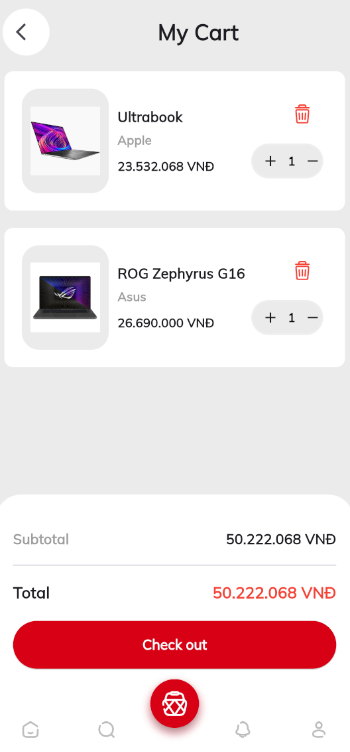 Giỏ hàng        |
| 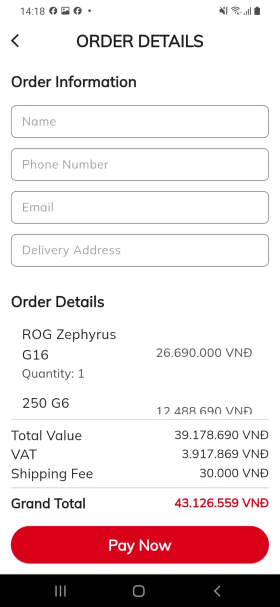 Chi tiết đơn hàng | 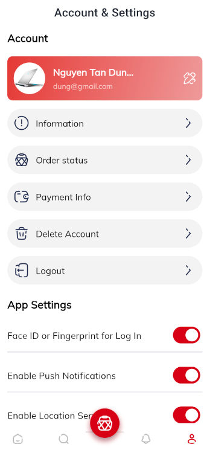 Cài đặt  | 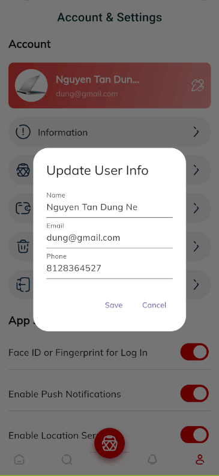 Cập nhật thông tin | 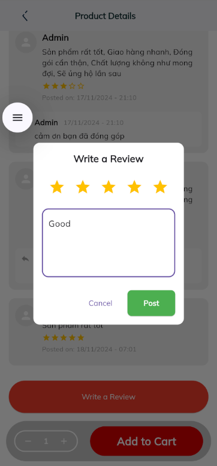 Viết đánh giá |

---

Hãy tải ngay ứng dụng **HDTech** để trải nghiệm thế giới công nghệ laptop ngay trong tầm tay bạn!  
Download **HDTech** now to explore the world of laptop technology at your fingertips!
